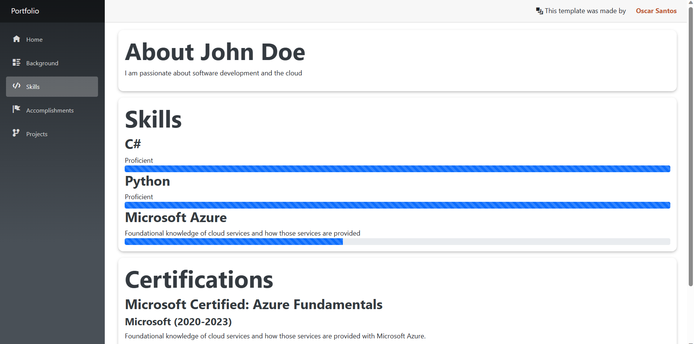
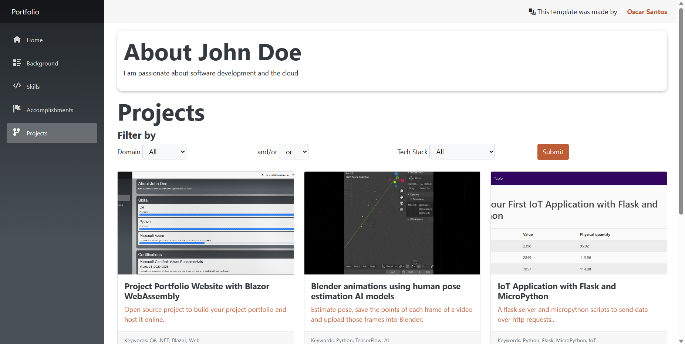

# Portfolio Blazor Template
This is a customizable Blazor portfolio project.

|   Project   |          
|:-------------------------:|
|     |
|    |


# Table of Contents

1. [About this repo](#about-this-repo)
    - [What has changed?](#what-has-changed)
2. [Getting started](#getting-started)
    - [Installs required](#installs-required)
    - [Build and run](#build-and-run)
3. [Project details](#project-details)
    - [Components](#components)
    - [Data](#data)
    - [ViewModels](#viewmodels)
    - [Styling](#styling)
4. [Resources](#resources)
    - [GitHub Codespaces](#github-codespaces)
    - [GitHub Actions](#github-actions)
    - [Azure Static Web Apps](#azure-static-web-apps)
    - [Visual Studio Code](#visual-studio-code)
    - [Debugging Resources](#debugging-resources)

## About this repo

This repo is based on the "Build your Project Portfolio website with .NET session" from the [dotnetconf-studentzone](https://github.com/microsoft/dotnetconf-studentzone).


| Session Title | Speaker(s) | Tools | Session Code | Video | Presentation |
|-------|---------|-----------|---|---|---|
| Build your Project Portfolio website with .NET | Matt Soucoup | Blazor | [Project Portfolio with Blazor Session](https://github.com/microsoft/dotnetconf-studentzone/tree/main/Build%20your%20Project%20Portfolio%20website%20with%20.NET/README.md) | [Watch On-Demand](https://youtu.be/SCJu7YPNtdQ?t=2596) |[Presentation](https://github.com/microsoft/dotnetconf-studentzone/blob/main/decks/Build-a-portfolio-using-blazor.pdf) |

### What has changed?
I re-structured the project and used MVVM to separate the UI from the Models. 

In any case, the only requirement to be up and running is to replace your data in the resume.json file. Therefore, you don't have to worry about MVVM unless your intention is to add or remove code.

Furthermore, I split the `Resume` component into different components that are rendered in different routes. These routes are also included to the Navigation.

Finally, more components were added, and they are completely optional. If you do not want them at your resume, you can remove the info in `resume.json` and leave that field blank.

## Getting started

### Installs required
 * [Visual Studio](https://visualstudio.microsoft.com/?wt.mc_id=studentamb_118941) or [Visual Studio Code](https://code.visualstudio.com/?wt.mc_id=studentamb_118941) or directly open a GitHub Codespace from a fork of this repo.
 * [.NET SDK 6](https://dotnet.microsoft.com/download/dotnet/6.0?wt.mc_id=studentamb_118941)

### Build and run

To run the app, open up a terminal window and make sure you're in the same directory as the `Portfolio.csproj` file. (In this repo within the src folder). Then run:

```console
dotnet run
```

The terminal will display a variety of output, including the URL the site can be viewed at.

## Project details

- [Components](#components) - several components used to display pieces of the resume.
    - The most important components are `Background.razor`, `Skills.razor` and `Accomplishments.razor`. These components are responsible for grabbing the resume's data and displaying it.
- Navigation - changes made to `Shared/NavMenu.razor` to update the left hand navigation.
- [Data](#data) - a JSON file stored in `wwwroot/sample-data` that holds resume specific data.
- C# representation of the resume. Code in `Shared/Models/Resume.cs` that model the data from the `resume.json` in C#. 
- [ViewModels](#viewmodels) - being the link between UI and the Models.
- [Styling](#styling) - CSS changes used to make the resume.

### Components

- `Background`, a "smart" component you can navigate to via `/background`. This component contains the `About`, `Experience`, `Education`, `Volunteer` and `Community` presentation components that display this part of the resume.
- `Skills`, a "smart" component you can navigate to via `/skills`. This component contains the `About`, `Skill` and `Certification` presentation components that display this part of the resume.
- `Accomplishments`, a "smart" component you can navigate to via `/accomplishments`. This component contains `About`, `Award`, `Patent`, `Article`, `Conference` and `Mentorship` presentation components that display this part of the resume.
- `About`, presentation component rendering info about you.
- `Experience`, presentation component rendering an experience.
- `Education`, presentation component rendering an education.
- `Volunteer`, presentation component rendering a volunteering.
- `Skill`, presentation component rendering a skill.
- `Certification`, presentation component rendering a certification.
- `Community`, presentation component rendering a community.
- `Award`, presentation component rendering an award.
- `Patent`, presentation component rendering a patent.
- `Article`, presentation component rendering an article.
- `Conference`, presentation component rendering a conference.
- `Mentorship`, presentation component rendering a mentorship.


### Data

The idea is for this app to use an API. Currently, it relies on static data, a JSON file placed in `sample-data/resume.json`.

The data is a JSON file and looks like the following hierarchy:

```json
{
 "name": "string",
 "about": "string",
 "experiences" : [],
 "educations": [],
 "volunteers" : [],
 "skills" : [],
 "certifications" : [],
 "communities" : [],
 "awards" : [],
 "patents" : [],
 "articles" : [],
 "conferences" : [],
 "mentorships" : [],
 "projects" : []
}
```

### ViewModels

It contains an interface `IResumeViewModel.cs` and a class that implements it `ResumeViewModel.cs`

The class is in charge of making a GET Request, *here to a static file `resume.json`*, and then load its info to a component when required.

This is handy to separate the UI from the Models and, furthermore, a frontend developer can work separately from code logic within the components.

### Styling

Components rely mostly on `wwwroot/css/app.css`.

## Resources

### GitHub Codespaces

- [GitHub Codespaces overview](https://github.com/features/codespaces)
- [GitHub Codespaces docs](https://docs.github.com/es/codespaces/overview)

### GitHub Actions

- [GitHub Actions overview](https://github.com/features/actions)
- [GitHub Codespaces docs](https://docs.github.com/es/actions)

### Azure Static Web Apps

- Learn how to [Publish an Angular, React, Svelte, or Vue JavaScript app and API with Azure Static Web Apps](https://docs.microsoft.com/learn/modules/publish-app-service-static-web-app-api-dotnet?wt.mc_id=studentamb_118941)
- [API support in Azure Static Web Apps](https://docs.microsoft.com/azure/static-web-apps/apis?wt.mc_id=studentamb_118941)
- [Add an API to Azure Static Web Apps](https://docs.microsoft.com/azure/static-web-apps/add-api?wt.mc_id=studentamb_118941)
- [Authentication and authorization](https://docs.microsoft.com/azure/static-web-apps/authentication-authorization?wt.mc_id=studentamb_118941)
- [Routes](https://docs.microsoft.com/azure/static-web-apps/routes?wt.mc_id=studentamb_118941)
- [Review pre-production environments](https://docs.microsoft.com/azure/static-web-apps/review-publish-pull-requests?wt.mc_id=studentamb_118941)

### Visual Studio Code

- [Azure Free Trial](https://azure.microsoft.com/free/?wt.mc_id=studentamb_118941)
- [VS Code](https://code.visualstudio.com?wt.mc_id=studentamb_118941)
- [VS Code Extension for Node on Azure](https://marketplace.visualstudio.com/items?itemName=ms-vscode.vscode-node-azure-pack&WT.mc_id=mslearn_staticwebapp-github-aapowell)
- Azure Functions [local.settings.json](https://docs.microsoft.com/azure/azure-functions/functions-run-local#local-settings-file?WT.mc_id=mslearn_staticwebapp-github-aapowell) file

### Debugging Resources

- [Debugging Blazor WebAssembly](https://docs.microsoft.com/aspnet/core/blazor/debug?wt.mc_id=studentamb_118941)